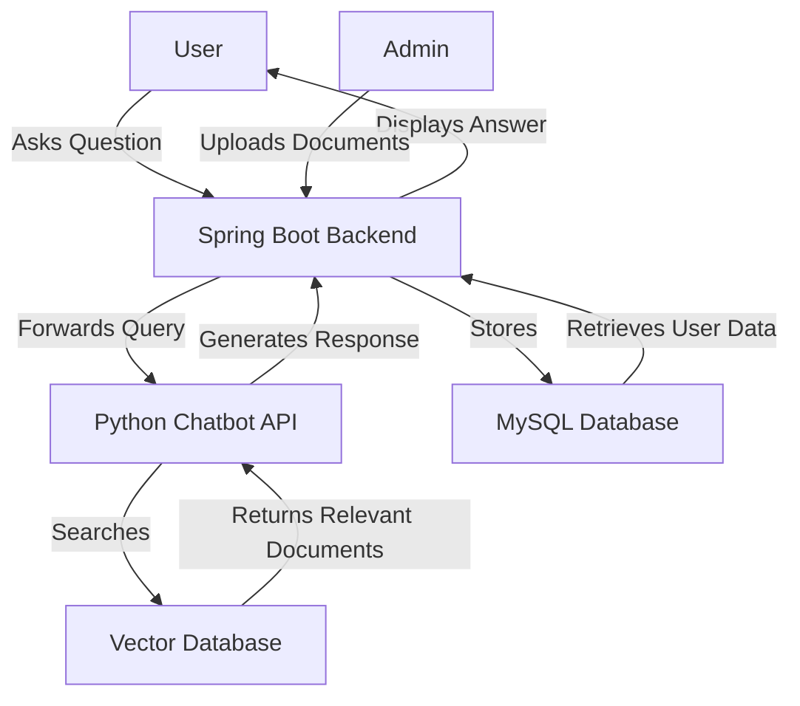

# FSBM Scholar Assistant

This repository contains a complete chatbot solution for the FSBM Scholar Assistant, consisting of a Python-based AI chatbot backend and a Spring Boot application for the web interface.


## Features

- **AI-Powered Responses**: Utilizes LangChain and vector embeddings to provide intelligent answers based on course materials
- **Document Search**: Searches through uploaded documents to find relevant information
- **Multi-Language Support**: Supports both French and English queries
- **User Authentication**: Secure login system for students and administrators
- **Document Management**: Upload and manage course materials
- **Feedback System**: Collects user feedback to improve responses
- **Conversation History**: Maintains context throughout conversations

## System Requirements

- Python 3.8+ (for the chatbot)
- Java 21 (for the Spring Boot backend)
- MySQL 8.0+ (for the database)
- Node.js and npm (if there's a frontend component)

## Project Structure

The project consists of two main components that need to run simultaneously:

1. **Python Chatbot API** (`/chatbot` directory) - AI-powered chatbot using LangChain and vector embeddings
2. **Spring Boot Backend** (`/fsbm-chatbot-backend` directory) - Java backend for web interface and database management

## Architecture



## User Flow

1. **User Authentication**:
   - Users log in through the Spring Boot web interface
   - Authentication is handled by Spring Security with JWT tokens

2. **Asking Questions**:
   - User submits a question through the web interface
   - The Spring Boot backend forwards the query to the Python API
   - The Python API uses vector embeddings to find relevant documents
   - The AI model generates a response based on the retrieved documents
   - The response is sent back to the user

3. **Document Management** (Admin only):
   - Administrators can upload new course materials
   - Documents are processed and converted to vector embeddings
   - These embeddings are stored in the FAISS vector database

4. **Feedback Collection**:
   - Users can provide feedback on the quality of responses
   - Feedback is stored in the MySQL database for future improvements

## Quick Start (Run Everything at Once)

1. Install MySQL if not already installed and create the database:
   ```sql
   CREATE DATABASE FSBM_Scholar_Assistant;
   ```

2. Install Python dependencies:
   ```bash
   pip install -r chatbot/requirements.txt
   ```

3. **IMPORTANT:** Replace the OpenRouter API key with your own:
   - Open `chatbot/connect_memory_with_llm_lighter_cos.py`
   - Find line 69 (in the `OpenRouterLLM` class):
     ```python
     "Authorization": f"Bearer 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",
     ```
   - Replace the API key with your own OpenRouter API key

4. Open two separate terminal windows and run the following commands:

   **Terminal 1 - Start Python API:**
   ```bash
   python chatbot/api.py
   ```

   **Terminal 2 - Start Spring Boot Backend:**
   ```bash
   # On Linux/Mac
   ./fsbm-chatbot-backend/mvnw -f fsbm-chatbot-backend/pom.xml spring-boot:run
   
   # On Windows
   fsbm-chatbot-backend\mvnw.cmd -f fsbm-chatbot-backend\pom.xml spring-boot:run
   ```

   **Terminal 3 - Start Frontend:**
   ```bash
   cd frontEnd
   npm run serve
   ```

5. Access the application:
   - Frontend: http://localhost:8080
   - Spring Boot Backend: http://localhost:8443
   - Python API Documentation: http://localhost:8000/docs
   
   > **Note**: You can also access the chat page directly via: http://localhost:8080/Page_de_Chat.html

## Detailed Setup Instructions

### 1. Setting up the Database

1. Install MySQL if not already installed
2. Create a new database:
   ```sql
   CREATE DATABASE FSBM_Scholar_Assistant;
   ```
3. The Spring Boot application will automatically create the tables when it starts

### 2. Setting up the Python Chatbot

1. Install the required Python packages:
   ```bash
   pip install -r chatbot/requirements.txt
   ```

2. **Replace the OpenRouter API key**:
   - Open `chatbot/connect_memory_with_llm_lighter_cos.py`
   - Locate line 69 with the API key:
     ```python
     "Authorization": f"Bearer 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",
     ```
   - Replace it with your own OpenRouter API key
   - You can get an API key by signing up at [OpenRouter.ai](https://openrouter.ai/)

3. Start the Python API:
   ```bash
   python chatbot/api.py
   ```
   
   The API will run on `http://localhost:8000`
   
4. Test the API using the FastAPI documentation:
   - Open your browser and go to `http://localhost:8000/docs`
   - You'll see the interactive API documentation where you can test the `/chat` endpoint
   - Note: Accessing `/chat` directly in the browser will show "Method Not Allowed" because it requires a POST request

### 3. Setting up the Spring Boot Backend

1. Build the project using Maven:
   ```bash
   # On Linux/Mac
   ./fsbm-chatbot-backend/mvnw -f fsbm-chatbot-backend/pom.xml clean install
   
   # On Windows
   fsbm-chatbot-backend\mvnw.cmd -f fsbm-chatbot-backend\pom.xml clean install
   ```

2. Run the Spring Boot application:
   ```bash
   # On Linux/Mac
   ./fsbm-chatbot-backend/mvnw -f fsbm-chatbot-backend/pom.xml spring-boot:run
   
   # On Windows
   fsbm-chatbot-backend\mvnw.cmd -f fsbm-chatbot-backend\pom.xml spring-boot:run
   ```
   
   The Spring Boot application will run on `http://localhost:8443`

### 4. Setting up the Frontend

1. Navigate to the frontend directory:
   ```bash
   cd frontEnd
   ```

2. Install dependencies (if running for the first time):
   ```bash
   npm install
   ```

3. Start the development server:
   ```bash
   npm run serve
   ```
   
   The frontend will run on `http://localhost:8080`

   **Direct Access to Chat Page**:
   After starting the frontend server, you can access the chat page directly at:
   ```
   http://localhost:8080/Page_de_Chat.html
   ```

## How It Works

The FSBM Scholar Assistant uses a combination of technologies to provide intelligent responses:

1. **Document Processing**: Course materials are processed and converted to vector embeddings
2. **Query Processing**: Student questions are analyzed and matched with relevant document sections
3. **Response Generation**: The AI model generates responses based on the matched documents
4. **User Interface**: The Spring Boot application provides a web interface for interacting with the chatbot

## Important Notes

- **Both applications must be running simultaneously** for the system to work properly.
- The Spring Boot backend communicates with the Python chatbot API via HTTP requests.
- The Python API's `/chat` endpoint requires a POST request with a JSON body, not a GET request. Use the `/docs` endpoint to test the API directly.
- **API Key**: You need to replace the OpenRouter API key in the code with your own key for the chatbot to work properly.

## Configuration

### Python Chatbot API

The Python chatbot uses the following environment variables and configurations:
- Vector store path: `vectorstore/db_faiss`
- Logs directory: `logs/`
- OpenRouter API key: Must be replaced in `connect_memory_with_llm_lighter_cos.py` (line 69)
- OpenRouter model: "meta-llama/llama-4-scout:free" (can be changed in the code)

### Spring Boot Backend

The Spring Boot backend configuration is in `src/main/resources/application.properties`:
- Database connection details
- Server port (8443)
- JWT configuration
- File upload settings
- Email configuration

## Troubleshooting

- If you encounter database connection issues, verify your MySQL credentials in `application.properties`
- If you see "Method Not Allowed" when accessing `/chat` directly in the browser, this is normal - the endpoint requires a POST request, not GET
- To test the API directly, use the FastAPI documentation at `http://localhost:8000/docs`
- If you get API key errors, make sure you've replaced the OpenRouter API key with your own valid key
- Check the logs in `chatbot/logs/app.log` for Python API issues

## Security Notice

- For production deployment, replace the JWT secret in `application.properties` with a strong secret key
- Update database credentials and other sensitive information before deploying to production
- Do not commit your OpenRouter API key to version control - consider using environment variables instead "# university-scholar-assistant" 
"# university-scholar-assistant" 
"# university-scholar-assistant" 
#
